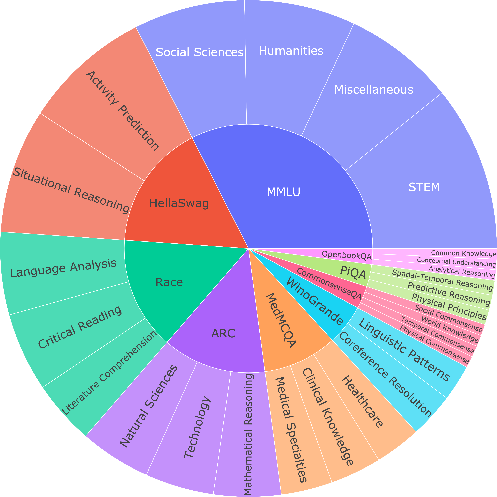

<p align="center" width="100%">

</p>

# Open-LLM-Leaderboard: Open-Style Question Evaluation

[](https://x.com/open_llm_lb)
[](https://vila-lab.github.io/Open-LLM-Leaderboard-Website/)
<a href="https://arxiv.org/abs/2406.07545"></a>
[](https://creativecommons.org/licenses/by/4.0/)
[](https://www.python.org/downloads/release/python-390/)
[](https://github.com/VILA-Lab/Open-LLM-Leaderboard/issues)

We introduce the [Open-LLM-Leaderboard](https://arxiv.org/abs/2406.07545) to track various LLMs’ performance on open-style questions and reflect their true capability.
You can use OSQ-bench questions and prompts to evaluate your models automatically with an LLM-based evaluator.
The leaderboard is available for viewing on [HuggingFace](https://huggingface.co/spaces/Open-Style/OSQ-Leaderboard). 

## Contents
- [Open-LLM-Leaderboard: Open-Style Question Evaluation](#open-llm-leaderboard-open-style-question-evaluation)
  - [Contents](#contents)
  - [Pre-Generated Model Answers and Evaluation](#pre-generated-model-answers-and-evaluation)
  - [OSQ-Bench](#osq-bench)
    - [Evaluate a model on OSQ-bench](#evaluate-a-model-on-osq-bench)
      - [Step 1. Generate model answers to OSQ-bench questions](#step-1-generate-model-answers-to-osq-bench-questions)
      - [Step 2. Generate GPT-4 evaluation](#step-2-generate-gpt-4-evaluation)
  - [Contributing a model](#contributing-a-model)
  - [Leaderboards](#leaderboards)
  - [Citation](#citation)
  - [Acknowledgments](#acknowledgments)

## Pre-Generated Model Answers and Evaluation
We provide pre-generated model answers and evaluation for models. 
They can be downloaded using the [Huggingface dataset](https://huggingface.co/datasets/Open-Style/Open-LLM-Benchmark).
You can also view them at [Google Drive](https://drive.google.com/drive/folders/1onO68rKkpKGxO8xXSZqPdMJUq3Mbqkaq?usp=sharing).
```python
import datasets
gpt4_responses = datasets.load_dataset("Open-Style/Open-LLM-Benchmark", "gpt4")
```
Each data point is represented as the following:
```json
{
  "question": "What is the main function of photosynthetic cells within a plant?",
  "gold_answer": "to convert energy from sunlight into food energy",
  "os_answer": "The main function of photosynthetic cells ...",
  "os_eval": "Correct",
  "mcq_answer": "C",
  "mcq_eval": true,
  "dataset": "ARC"
}
```
## OSQ-Bench
OSQ-bench is a set of questions from datasets MMLU, ARC, WinoGrande, PIQA, CommonsenseQA, Race, MedMCQA, and OpenbookQA that are suitable for open-style answering.
To automate the evaluation process, we use LLMs like GPT-4 to act as evaluators and assess the quality of the models' responses.

<div align=center>

</div>

### Evaluate a model on OSQ-bench

#### Step 1. Generate model answers to OSQ-bench questions
To evaluate a model you need to:

1. Download the benchmark and generate the answers. You can use the Huggingface dataset to download it:
```python
import datasets
import json

eval_set = datasets.load_dataset("Open-Style/Open-LLM-Benchmark", "questions")
grouped_responses = []
for example in eval_set['train']:
    # generate here is a placeholder for your models generations
    response = {"Question": example["question"], "os_answer": generate(example["question"]), "dataset": example["dataset"]}
    dataset = example["dataset"]
    if dataset not in grouped_responses:
        grouped_responses[dataset] = []
    grouped_responses[dataset].append(response)
```
Or lm-evaluation-harness can be used to generate the answers. To use it first run: `pip install lm-eval`. Then run the following for the tasks in `lm-eval-tasks` folder:
```
lm_eval \
    --model hf \
    --model_args pretrained=[MODEL-NAME] \
    --tasks os_mmlu \
    --device cuda:0 \
    --num_fewshot 0 \
    --include_path ./ \
    --batch_size auto \
    --output_path mmlu.jsonl \
    --log_samples \
    --predict_only 
```
#### Step 2. Generate GPT-4 evaluation
In this step, we ask GPT-4 to grade the model's answer by comparing it to the correct answer from the benchmark.
For each turn, GPT-4 will give the answer 'Correct' or 'Incorrect'. We then compute the average score on all turns.
```
export OPENAI_API_KEY=XXXXXX  # set the OpenAI API key
python evaluate.py --model [MODEL-NAME] --parallel [num-concurrent-api-call]
```
e.g.,
```
python evaluate.py --model gpt4o --parallel 2
```
The evaluation will be saved to `evaluations/{model}/{dataset}.json`

## Contributing a model
We are accepting PRs for new models. We will update the [leaderboard](#leaderboards) with new models.
Please follow the steps in [Evaluate a model on OSQ-bench](#evaluate-a-model-on-osq-bench) to run inference on the model and produce
outputs on the benchmark. You can evaluate the model with GPT-4 or submit the outputs by the following [link](https://forms.gle/t9kWnC5JZ81u4Luu9). 

## Leaderboards
Our leaderboards are based on the [OSQ-bench](#osq-bench). We have 2 (Large and Small Models) leaderboards based on the scale of LLMs.

**Large-Scale LLMs leaderboard**:
| Model              | Overall | MMLU  | ARC   | WG   | PIQA  | CSQA  | Race  | MedMCQA | OBQA  |
|--------------------|:-------:|:-----:|:-----:|:----:|:-----:|:-----:|:-----:|:-------:|:-----:|
| GPT-4o-2024-05-13  |  70.15  | 79.09 | 86.31 | 72.22|  60.34|  70.28|  67.87|   57.85 | 67.21 |
| GPT-4-1106-preview |  65.93  | 74.77 | 82.68 | 66.22|  61.64|  62.96|  67.05|   51.81 | 60.29 |
| Claude-3 Opus      |  62.53  | 70.23 | 75.47 | 63.54|  59.05|  63.66|  66.22|   49.14 | 52.95 |
| Mistral Large      |  60.84  | 68.76 | 72.32 | 56.83|  61.21|  55.35|  70.17|   43.44 | 58.66 |
| GPT-3.5            |  60.32  | 65.38 | 78.42 | 64.56|  54.89|  67.89|  60.11|   41.42 | 49.90 |
| Gemini 1.0 Pro     |  54.06  | 56.04 | 72.35 | 56.35|  47.70|  50.56|  61.02|   35.89 | 52.55 |
| Llama3-70b-Instruct|  52.92  | 59.67 | 67.09 | 57.14|  43.10|  55.49|  58.21|   41.67 | 40.94 |


**Small-Scale LLMS leaderboard**:
| Model                         | Overall | MMLU  | ARC   | WG   | PIQA  | CSQA  | Race  | MedMCQA | OBQA  |
|-------------------------------|:-------:|:-----:|:-----:|:----:|:-----:|:-----:|:-----:|:-------:|:-----:|
| Qwen1.5 (1.8B)                 |  21.68  | 9.99  | 15.84 | 40.96|  15.52|  31.13|  34.91|   4.70  | 20.37 |
| Gemma (2B)                     |  16.66  | 17.52 | 23.93 | 16.10|  15.09|  27.46|  14.32|   4.57  | 14.26 |
| SlimPajama-DC (1.3B)           |  9.60   | 9.22  | 14.95 | 14.76|  5.32 |  9.01 |  16.19|   1.68  | 5.70  |
| RedPajama (1.3B)               |  9.00   | 9.21  | 13.50 | 16.97|  0.86 |  11.41|  14.35|   1.86  | 3.87  |
| OLMo (1.2B)                    |  8.85   | 8.54  | 13.18 | 6.16 |  8.05 |  13.10|  13.61|   2.07  | 6.11  |
| Pythia (1.4B)                  |  8.79   | 9.66  | 14.69 | 11.52|  4.17 |  9.01 |  12.76|   3.19  | 5.30  |
| TinyLlama (1.1B)               |  8.45   | 8.94  | 13.31 | 12.23|  3.59 |  6.06 |  16.70|   2.07  | 4.68  |
| OPT (1.3B)                     |  7.89   | 7.40  | 11.83 | 12.47|  4.48 |  7.61 |  13.61|   1.25  | 4.48  |
| GPT-Neo (1.3B)                 |  7.42   | 6.94  | 9.69  | 10.81|  4.31 |  6.34 |  13.75|   2.63  | 4.89  |
| Cerebras-GPT (1.3B)            |  4.86   | 5.37  | 4.43  | 9.31 |  2.16 |  6.20 |  6.90 |   1.04  | 3.46  |

## Citation

```
@article{myrzakhan2024openllmleaderboard,
  title={Open-LLM-Leaderboard: From Multi-choice to Open-style Questions for LLMs Evaluation, Benchmark, and Arena},
  author={Aidar Myrzakhan, Sondos Mahmoud Bsharat, Zhiqiang Shen},
  journal={arXiv preprint arXiv:2406.07545},
  year={2024},
}
```

## Acknowledgments
We extend our deepest gratitude to the authors and contributors of the following datasets: [MMLU](https://github.com/hendrycks/test), [ARC](https://allenai.org/data/arc), [WinoGrande](https://winogrande.allenai.org/), [PIQA](https://leaderboard.allenai.org/physicaliqa/submissions/get-started), [CommonsenseQA](https://www.tau-nlp.sites.tau.ac.il/commonsenseqa), [Race](https://www.cs.cmu.edu/~glai1/data/race/), [MedMCQA](https://medmcqa.github.io/), [OpenbookQA](https://allenai.org/data/open-book-qa), and [Hellaswag](https://rowanzellers.com/hellaswag/).
